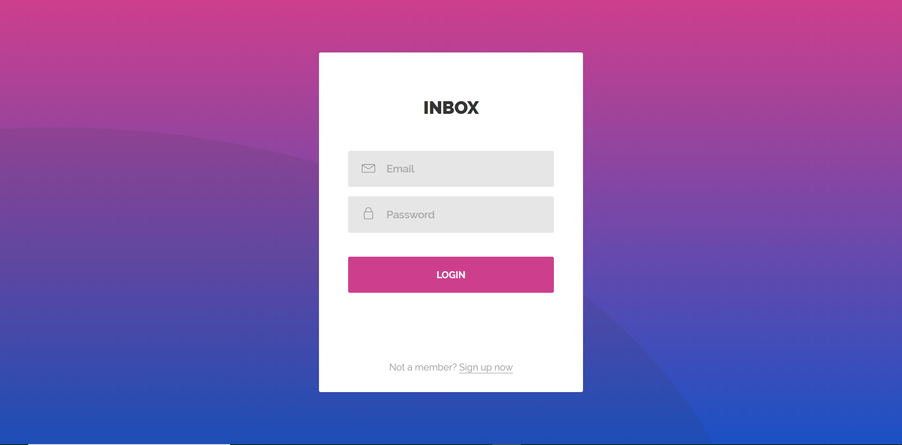
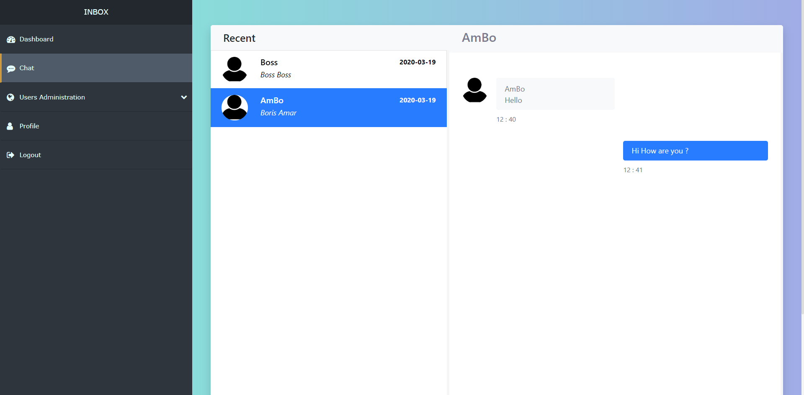

= Inbox Chat

The Inbox-chat is a chat application programming with Java and javascript .
It contains the following features:

* a Java 11 web application based on Spring Boot and Salespoint framework (see `src/main/java`)

== How to run the application?

* In the IDE: find `InboxChatAppApplication.java`, right-click project, select "Run As > Java Application"
* From the command line: run `./mvnw spring-boot:run`

== How to package the application?

* Run `./mvnw clean package`. The packaged application (a JAR in `target/`) can be run with `java -jar $jarName`.

== Important 
=== first login as : 
* Username : boss@abc.com
* Password : abc

=== You can also register on page :
* http://localhost:8080/sign-up

=== Preview - Login

=== Preview - Services

